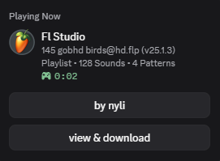

# fruityrpc

discord rich presence for **fl studio**, made by [nyli](https://github.com/g-rl)

- works with **every fl studio version**, 32-bit, 64-bit and portable
- shows your project, the real build number, what you are doing, and the elapsed time
- never touches your projects or your audio

<p align="center">
  
</p>

## download

grab the latest zip from [releases](https://github.com/g-rl/fruityrpc/releases), extract it anywhere, and run `Setup.bat`.

## setup

1. run **`Setup.bat`** and follow the three steps it prints
2. make a discord application at [discord.com/developers](https://discord.com/developers/applications), name it `FL Studio`, upload the images from `assets` under **rich presence > art assets**, and paste the application id into setup
3. in fl studio: **options > general settings > external tools**, point a row at `FruityRPC.exe` and tick **launch at startup**

## config

everything is in `data\config.yml` next to the exe. it is created on first run, commented, and re-read while running, so edits show up within seconds.

```yaml
icon:
  mode: fixed          # fixed | random | cycle
  name: fl_logo        # any art asset you uploaded

buttons:
  - label: by nyli
    url: "https://github.com/g-rl"
  - label: view & download
    url: "https://github.com/g-rl/fruityrpc"
```

- **icon** — the big picture. any art asset name, or a list with `random` / `cycle`. anything that is not a real asset falls back to `fl_logo`
- **buttons** — label and link are both yours. discord shows two at a time, so extras take turns
- **statuses** — one block per situation (playing, recording, exporting, editing, idle, afk), each with its own two lines, badges and timer
- **activities** — maps the fl window you are in to the text on the presence
- **privacy** — hide project names, plugin names, or the presence entirely for chosen projects

## deep mode

fl studio does not tell the outside world what is happening inside a project, so fruityrpc installs a small script into fl's `Settings\Hardware` folder and attaches it to a spare midi input for you. no trip through midi settings.

with it: tempo, play/record, bar:beat, pattern, channel and mixer counts. without it: sounds, patterns and tempo still come from the saved `.flp`.

only written while fl is **closed**, so quit fl once after installing.

## help

run **`Diagnose.bat`** — it prints the fl window it found, the project it read, the exact presence being sent, and what is missing.

| problem | reason |
|---|---|
| "no client_id" | step 2 of setup is not finished |
| "could not reach discord" | the discord desktop app is not running |
| big image missing | the asset is not named `fl_logo`, or was uploaded minutes ago |
| no buttons | discord never shows your own buttons to you, ask a friend |

log file: `data\fruityrpc.log`. to stop it: `Stop-FruityRPC.bat`.

## credits

- [nyli](https://x.com/nyli2b) — fruityrpc
- [image-line](https://www.image-line.com/) — fl studio. you must own a license to use it
